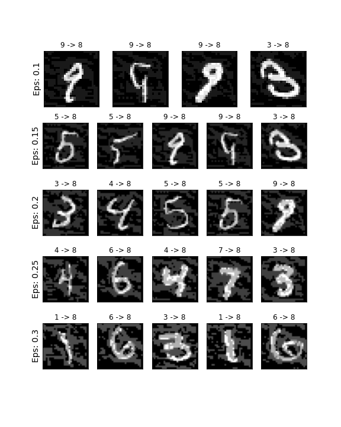
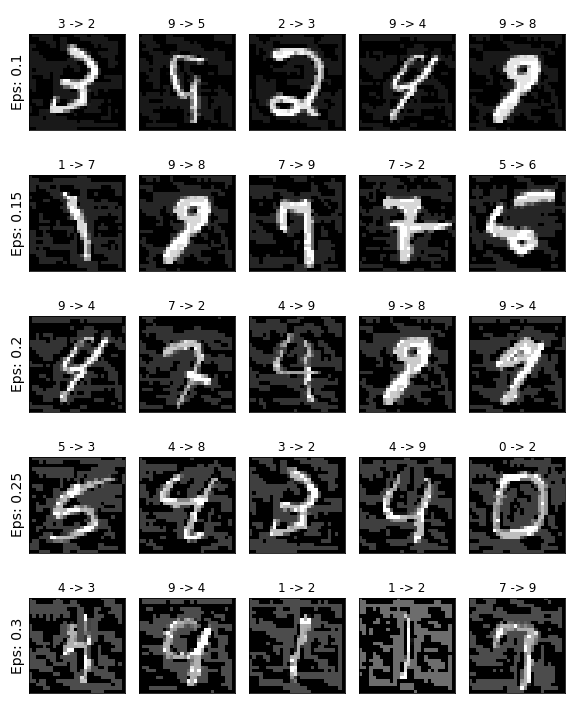

# FGSM-attack
Implementation of the targeted and untargeted Fast Gradient Sign Method attack [1] and a MNIST CNN classifier that is used to demonstrate the attack.

I implemented the MNIST CNN classifier and the FGSM attack to get familiar with pytorch.

## Reproduce

Check out `fgsm_attack.ipynb` and run the notebook.

## Results

### Targeted

### Untargeted

[1] Goodfellow, Ian J., Jonathon Shlens, and Christian Szegedy. "Explaining and harnessing adversarial examples." arXiv preprint arXiv:1412.6572 (2014).
